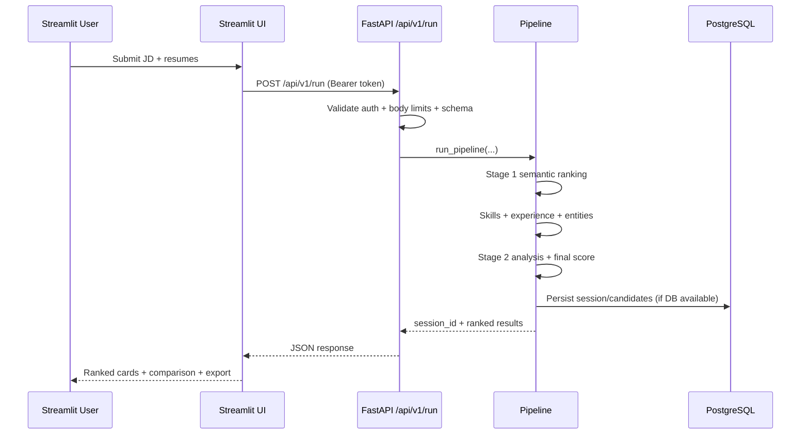
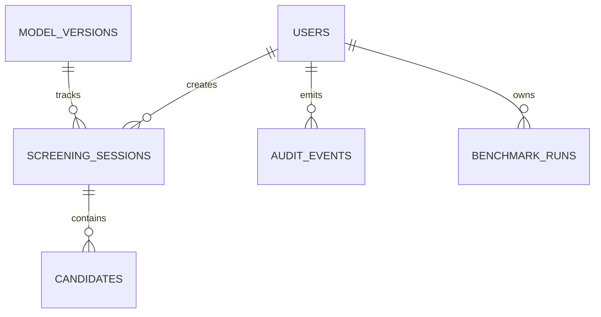

# Talent Scout Screening

An end-to-end resume screening platform with:

- `FastAPI` backend for ranking and session history APIs
- `Streamlit` UI for recruiter workflows
- `PostgreSQL` persistence for sessions, candidates, auth, and audits
- two-stage candidate evaluation pipeline (semantic ranking + structured analysis)
- JWT auth, request limits, rate limiting, and CI tests

## Why this project

Talent Scout is designed for practical recruiter operations:

- rank many resumes against a job description quickly
- explain *why* a candidate ranks where they do
- store screening sessions for later review
- compare candidates side-by-side in the UI

---

## Architecture Overview

### High-level Components

```mermaid
flowchart LR
    UI[Streamlit UI] -->|HTTP + Bearer Token| API[FastAPI API]

    API --> AUTH[JWT Auth]
    API --> LIMITS[Rate + Body Limits]
    API --> ROUTES[/api/v1 routes]

    ROUTES --> PIPE[Pipeline Orchestrator]
    PIPE --> STAGE1[Stage 1: Semantic Ranker<br/>SentenceTransformer]
    PIPE --> SKILLS[Skill Extractor]
    PIPE --> EXP[Experience Parser]
    PIPE --> ENT[Entity Extractor]
    PIPE --> STAGE2[Stage 2: Structured Analysis]
    STAGE2 -. optional .-> GROQ[(Groq API)]
    STAGE2 -. optional .-> GH[(GitHub API)]

    PIPE --> SCORE[Weighted Scoring]
    ROUTES --> DB[(PostgreSQL)]
```

### `/run` Request Flow



### Core Data Model



---

## Repository Structure

```text
.
├── api/                    # FastAPI app, routes, auth, deps, schemas
├── core/                   # Ranking, extraction, scoring, orchestration
├── db/                     # SQLAlchemy models + SQL schema
├── ui/                     # Streamlit application
├── config/                 # scoring + skill alias configs
├── alembic/                # DB migrations
├── tests/                  # pytest suite
├── .github/workflows/ci.yml
├── Dockerfile
└── docker-compose.yml      # PostgreSQL service
```

---

Fine-tuning experiments are intentionally excluded from this repository for now
and will be published in a separate repository.

## Tech Stack

- Python 3.10+
- FastAPI + Uvicorn
- Streamlit
- PostgreSQL + SQLAlchemy + Alembic
- SentenceTransformers / PyTorch
- spaCy (`en_core_web_lg`) for NER
- pytest + TestClient for automated tests

---

## Quick Start (Local Dev)

### 1) Create virtual environment and install dependencies

```bash
python -m venv .venv
```

Windows PowerShell:

```powershell
.\.venv\Scripts\Activate.ps1
pip install -r requirements.txt
```

Linux/macOS:

```bash
source .venv/bin/activate
pip install -r requirements.txt
```

### 2) Configure environment

```bash
cp .env.example .env
```

Set real values in `.env`:

- `DATABASE_URL` (required)
- `JWT_SECRET_KEY` (required, strong random secret)
- `GROQ_API_KEY` (optional but recommended for enhanced stage-2 phrasing)

### 3) Start PostgreSQL

Option A (recommended): Docker

```bash
docker compose up -d postgres
```

Default docker DB endpoint from this compose file:

- host: `127.0.0.1`
- port: `5432`
- db: `talent_scout`
- user: `talent_admin`
- password: `talent_password`

### 4) Run migrations

```bash
alembic upgrade head
```

### 5) Start API

```bash
python -m uvicorn api.main:app --host 0.0.0.0 --port 8000 --reload
```

### 6) Create a user and get token

Register:

```bash
curl -X POST http://localhost:8000/api/v1/register \
  -H "Content-Type: application/json" \
  -d "{\"email\":\"recruiter@example.com\",\"full_name\":\"Recruiter\",\"password\":\"Passw0rd!123\",\"role\":\"recruiter\"}"
```

Login:

```bash
curl -X POST http://localhost:8000/api/v1/login \
  -H "Content-Type: application/json" \
  -d "{\"email\":\"recruiter@example.com\",\"password\":\"Passw0rd!123\"}"
```

Copy `access_token` from login response.

### 7) Start UI

```bash
streamlit run ui/streamlit_app.py
```

Open `http://localhost:8501`, paste your token into **API Bearer Token** in the sidebar, then run screenings.

---

## API Reference (Core Endpoints)

Base URL: `http://localhost:8000`

| Endpoint | Method | Auth | Description |
|---|---|---|---|
| `/health` | GET | No | Liveness check |
| `/api/v1/register` | POST | No | Register user and receive JWT |
| `/api/v1/login` | POST | No | Login and receive JWT |
| `/api/v1/run` | POST | Yes | Run full ranking pipeline |
| `/api/v1/sessions` | GET | Yes | List prior sessions |
| `/api/v1/sessions/{session_id}` | GET | Yes | Fetch candidates in one session |

### Sample `/run` payload

```json
{
  "job_title": "ML Engineer",
  "job_description": "We need Python, PyTorch, SQL, and Docker experience.",
  "role_profile": "junior",
  "resumes": [
    { "id": "resume_1", "resume_text": "..." },
    { "id": "resume_2", "resume_text": "..." }
  ],
  "model_version_id": null,
  "scoring_config": null
}
```

---

## Security, Limits, and Validation

- JWT protection on `/run` and session endpoints
- rate limiting on `/run` (default: `10/minute`, configurable via `RUN_RATE_LIMIT`)
- request body size enforcement (`MAX_REQUEST_BODY_BYTES`)
- schema-level limits for job description and resume text lengths
- pipeline-level defensive validation for oversized or invalid inputs

---

## Configuration

Important environment variables (`.env`):

| Variable | Purpose |
|---|---|
| `DATABASE_URL` | SQLAlchemy DB connection string (required) |
| `JWT_SECRET_KEY` | JWT signing key (required) |
| `ACCESS_TOKEN_EXPIRE_MINUTES` | JWT expiration time |
| `RUN_RATE_LIMIT` | Rate limit for `/run` |
| `MAX_REQUEST_BODY_BYTES` | Hard cap for request payload size |
| `MAX_JOB_DESCRIPTION_CHARS` | Max JD length |
| `MAX_RESUME_TEXT_CHARS` | Max resume length |
| `MAX_RESUMES_PER_REQUEST` | Max resumes per call |
| `SKILL_ALIASES_PATH` | Path to custom skill taxonomy file |
| `GROQ_API_KEY` | Enables Groq polishing in stage-2 |
| `FINETUNED_MODEL_DIR` | Local fine-tuned embedding model directory |

### Skill Taxonomy Customization

Talent Scout supports extended/override skill aliases from YAML/JSON.

Default file: `config/skills_aliases.yml`

Example:

```yaml
skill_aliases:
  rust:
    - rust
    - rustlang
  kubeflow:
    - kubeflow
```

Set path with:

```env
SKILL_ALIASES_PATH=config/skills_aliases.yml
```

---

## Migrations

Create migration:

```bash
alembic revision --autogenerate -m "describe change"
```

Apply migrations:

```bash
alembic upgrade head
```

Show migration history:

```bash
alembic history
```

---

## Testing and Quality

Run all tests:

```bash
pytest -q
```

CI workflow:

- file: `.github/workflows/ci.yml`
- runs tests on push and pull requests

---

## Docker

Build API image:

```bash
docker build -t talent-scout-api .
```

Run API container:

```bash
docker run --rm -p 8000:8000 --env-file .env talent-scout-api
```

If your DB is outside the container network, set `DATABASE_URL` host accordingly (commonly `host.docker.internal` on Docker Desktop).

---

## Troubleshooting

### `401 Unauthorized` on `/run` or `/sessions`

- ensure you logged in and copied `access_token`
- ensure Streamlit sidebar contains `API Bearer Token`

### `503 Database unavailable` on sessions

- verify PostgreSQL is running
- verify `DATABASE_URL` credentials/host/port
- run `alembic upgrade head`

### spaCy model warning (`en_core_web_lg` not found)

Install model:

```bash
python -m spacy download en_core_web_lg
```

---

## License

This project is licensed under the MIT License. See [LICENSE](LICENSE).
