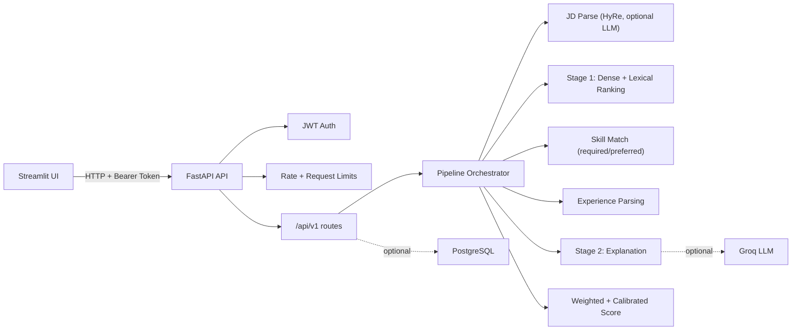

# Talent Scout — Résumé Screening Engine

[](https://github.com/Eslamelzamkan/talent-scout-screening/actions/workflows/ci.yml)
[](https://www.python.org/)
[](https://fastapi.tiangolo.com/)
[](https://streamlit.io/)
[](LICENSE)

An **explainable, AI-assisted résumé screening engine**: it ranks candidates against a job
description, shows *why* each candidate scored the way they did, and keeps a human recruiter in
control of every decision. This is the open-sourced screening component of **Talent Scout**, a
graduation project at New Mansoura University.

> **This repository is the standalone screening engine.** The complete Talent Scout platform
> (recruiter dashboards, assessments, AI video interview, the React/Express stack) is a separate
> private project.

---

## Why this exists

A single corporate opening attracts hundreds of applicants, but recruiter attention does not scale
with volume. Early-stage screening is **slow** (manual CV review), **inconsistent** (equally
qualified candidates scored differently), and **hard to audit** (the reasoning behind a decision is
rarely recorded). Naïve automation then trades manual effort for two new liabilities — **opacity**
(a single black-box score) and **inherited bias**.

This engine attacks all three: it ranks fast, applies the *same* explicit criteria to everyone, and
**persists a per-component score breakdown** so any ranking can be inspected later. The AI proposes;
the recruiter decides.

---

## The screening pipeline

```
CV text ─▶ JD parse (LLM, optional) ─▶ semantic match ─▶ skills + experience ─▶ weighted score ─▶ ranked, explained
            └ "ideal résumé" (HyRe)     └ dense + lexical    └ required/preferred   └ calibrated 0–100
```

1. **Extract** — résumé text via `pdfplumber` + lightweight NLP.
2. **Parse the JD (optional LLM)** — a Groq-hosted open model extracts required/preferred skills,
   seniority, and a hypothetical *"ideal résumé"* used as the search query (**HyRe / HyDE-style
   query expansion**). Falls back to regex when no LLM key is set.
3. **Semantic match** — a Sentence-BERT **bi-encoder** scores résumé↔query similarity, refined by a
   **cross-encoder re-ranker**, then blended with a **lexical keyword-overlap** signal.
4. **Skills & experience** — required vs. preferred skill matching (alias-aware) and date-range
   experience parsing that ignores education/internship noise.
5. **Score** — a weighted, **calibrated** 0–100 score from semantic / skills / experience
   components, with role-profile-aware experience caps.
6. **Explain** — a Stage-2 deterministic summary (optionally polished by the LLM) plus the full
   sub-score breakdown.

Every external dependency **degrades gracefully**: no LLM → regex JD parsing; no embedding model →
lexical-only scoring; no database → persistence is simply skipped.

---

## Design rationale (the ideas)

These are the decisions behind the engine and *why* they were made.

| Decision | Why |
|---|---|
| **Open bi-encoder (`bge-large-en-v1.5`)** over proprietary embedding APIs | Rank-1 on the MTEB retrieval benchmark among open models at adoption, MIT-licensed, and runs on commodity hardware — so **candidate PII never leaves your infrastructure**. The encoder is a pluggable config swap. |
| **Cross-encoder re-ranking** (`ms-marco-MiniLM`) blended `0.72 / 0.28` | Cross-encoder re-ranking is the most robust *zero-shot* ranking architecture across domains (BEIR); distillation keeps >99% of teacher accuracy at ~half the size, so it runs on CPU. Blending (not replacing) follows the IR result that neural rankers encode complementary signals best combined by interpolation. |
| **"Ideal résumé" query expansion (HyRe)** | A JD ("we are looking for…") and a résumé ("I built…") are different genres, so matching them directly is a cross-genre mismatch. Generating a hypothetical in-genre document and embedding *that* improves zero-shot dense retrieval without labels (HyDE / Query2doc). |
| **Semantic = `0.82` embedding + `0.18` lexical** | Keeps an exact-term signal alongside the embeddings, so rare keywords aren't washed out by semantics. |
| **Weighted final score `0.60 / 0.25 / 0.15`** (semantic / skills / experience), configurable & normalized | Makes evaluation criteria **explicit, reusable, and reproducible** across runs and recruiters — the opposite of an opaque single number. |
| **LLM parses, the deterministic scorer decides** | Given measured identity bias in LLM hiring outputs, the LLM only summarizes/extracts; the score itself is produced by deterministic code with a strict JSON-validated, regex-fallback contract. Correctness never depends on the provider. |
| **Role profiles** (fresh-grad → manager) | Calibrate experience caps and shortlist thresholds so a 4-year candidate isn't unfairly compared on a 20-year scale. |
| **Persisted sub-scores** | Explainability and auditability by construction — a shortlist can be reconstructed later from stored criteria and component scores. |

---

## Results (from the full Talent Scout project)

Measured on the public `netsol/resume-score-details` corpus. Domain fine-tuning of the matcher
(`all-MiniLM-L6-v2`) measurably improved ranking quality at *k = 10*:

| Metric | Baseline | Fine-tuned | Δ |
|---|---|---|---|
| **nDCG@10** | 0.552 | **0.747** | **+35.3%** (Wilcoxon *p* = 0.043) |
| MRR@10 | 0.639 | 0.778 | +21.7% |
| Spearman | 0.402 | 0.767 | +0.365 |

> Reported honestly as an **in-domain adaptation** result: the training and benchmark splits were
> drawn independently and not guaranteed disjoint, so part of the gain may reflect in-domain
> memorization. The deployed default runs `bge-large-en-v1.5`; a fine-tuned checkpoint can be loaded
> via `FINETUNED_MODEL_DIR`. The fine-tuning training code and the full evaluation (zero-shot
> benchmark, vocabulary-robustness, and a fairness probe) live with the graduation report and are
> not part of this repo.

---

## Quick start

### Option A — score résumés directly (no database, no API)

```bash
python -m venv .venv && source .venv/bin/activate   # Windows: .\.venv\Scripts\Activate.ps1
pip install -r requirements.txt
```

```python
from core.pipeline import run_pipeline

result = run_pipeline(
    job_title="Senior Python Backend Engineer",
    job_description="FastAPI, PostgreSQL, REST APIs, Docker. 3+ years building backend services.",
    resumes=[
        {"id": "A", "resume_text": "4 years building REST APIs with Python, FastAPI, PostgreSQL..."},
        {"id": "B", "resume_text": "Graphic designer, 5 years in Photoshop and Illustrator..."},
    ],
    repo=None,  # no DB -> persistence skipped
)
for r in result["results"]:
    print(r["id"], r["final_score"], r["skills_match"]["found"])
```

No `GROQ_API_KEY` → regex JD parsing. No embedding model downloaded yet → first run fetches
`bge-large-en-v1.5` from Hugging Face (or set `FINETUNED_MODEL_DIR` to a local checkpoint).

### Option B — full service (API + Streamlit + PostgreSQL)

```bash
cp .env.example .env          # set DATABASE_URL and JWT_SECRET_KEY
docker compose up -d postgres
alembic upgrade head
python -m uvicorn api.main:app --reload --port 8000   # API
streamlit run ui/streamlit_app.py                     # UI at http://localhost:8501
```

---

## Architecture



### Repository structure

```text
.
├── api/                      # FastAPI app, auth, routes, schemas
├── core/                     # the screening engine: ranking, skills, experience, scoring, JD parse
├── db/                       # SQLAlchemy models + schema.sql (optional persistence)
├── ui/                       # Streamlit recruiter app
├── config/                   # scoring.yaml + skills_aliases.yml
├── alembic/                  # database migrations
├── tests/                    # pytest suite (117 tests)
└── .github/workflows/ci.yml  # CI: tests on push/PR
```

---

## API reference

Base URL: `http://localhost:8000`

| Endpoint | Method | Auth | Description |
|---|---|---|---|
| `/health` | GET | No | Service liveness |
| `/api/v1/register` | POST | No | Create user, return JWT |
| `/api/v1/login` | POST | No | Login, return JWT |
| `/api/v1/run` | POST | Yes | Run the full ranking pipeline |
| `/api/v1/sessions` | GET | Yes | List prior screening sessions |
| `/api/v1/sessions/{id}` | GET | Yes | Candidates for a session |

Sample `/api/v1/run` body:

```json
{
  "job_title": "ML Engineer",
  "job_description": "Python, PyTorch, SQL, and Docker experience.",
  "role_profile": "junior",
  "resumes": [{ "id": "resume_1", "resume_text": "..." }]
}
```

---

## Security & guardrails

- JWT-protected screening/history endpoints; Argon2-style password hashing.
- Rate limiting on `/api/v1/run` (`RUN_RATE_LIMIT`, default `10/minute`).
- Request-body and input-size caps (JD length, résumé length, résumé count).
- Parameterized SQL throughout (no ORM string-building).

---

## Configuration

- Scoring defaults: `config/scoring.yaml`. Skill aliases: `config/skills_aliases.yml`
  (extendable via `SKILL_ALIASES_PATH`).
- Optional NER for candidate names: `python -m spacy download en_core_web_lg`
  (degrades gracefully if absent).
- Key env vars: `DATABASE_URL` (optional), `GROQ_API_KEY` (optional), `FINETUNED_MODEL_DIR`
  (optional), `JWT_SECRET_KEY`. See `.env.example`.

---

## Testing

```bash
pytest -q
```

---

## License

MIT — see [LICENSE](LICENSE).

<!-- Verified build and test suite. -->

