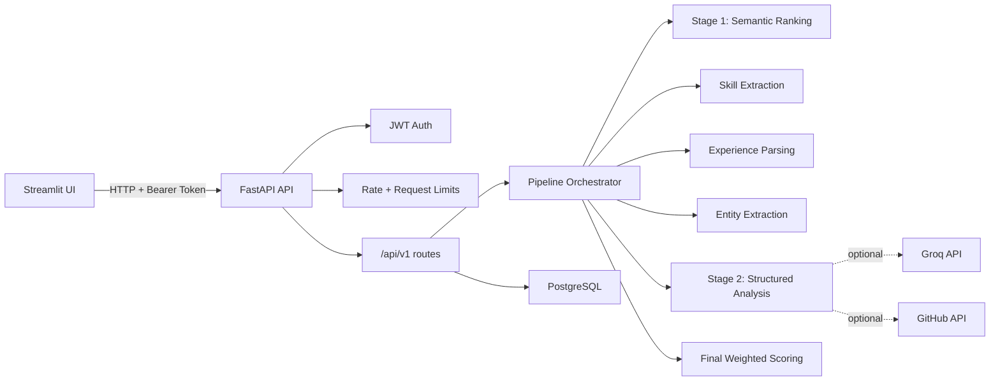
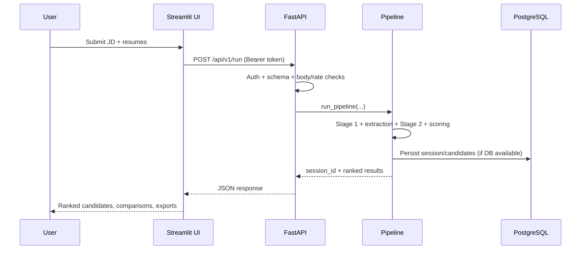
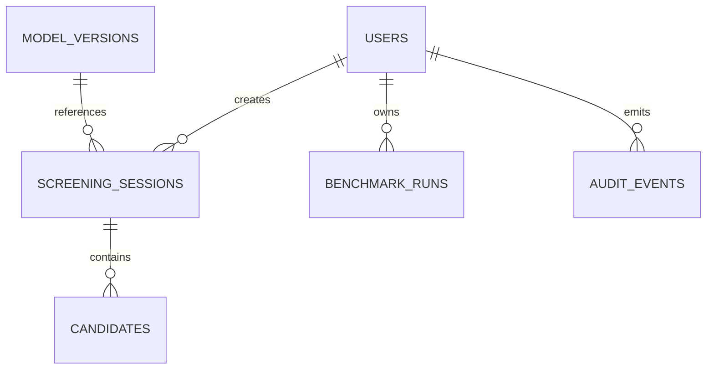

# Talent Scout Screening

[](https://www.python.org/)
[](https://fastapi.tiangolo.com/)
[](https://streamlit.io/)
[](LICENSE)

Talent Scout is an AI-assisted resume screening platform that ranks candidates against a job description, explains scoring signals, and stores screening history for review.

## What This Project Includes

- FastAPI backend (`api/`) for screening, history, auth, and health endpoints
- Streamlit app (`ui/`) for recruiter workflows and candidate comparison
- PostgreSQL persistence (`db/`) for users, sessions, candidates, and audit events
- Two-stage candidate evaluation pipeline (`core/`):
  - Stage 1 semantic ranking (SentenceTransformers)
  - Stage 2 structured recruiter analysis (optional Groq polishing)
- Security and reliability controls:
  - JWT-protected screening/history endpoints
  - Rate limiting on `/api/v1/run`
  - Request body and input-size guards
- Alembic migrations (`alembic/`)
- Automated test suite (`tests/`) + GitHub Actions CI (`.github/workflows/ci.yml`)

Fine-tuning experiments are intentionally not part of this repo and will be published separately.

---

## Architecture

### High-Level Components



### `/api/v1/run` Flow



### Data Model



---

## Repository Structure

```text
.
|- api/                      # FastAPI app, auth, routes, schemas
|- core/                     # Ranking, extraction, analysis, scoring
|- db/                       # SQLAlchemy models + schema.sql
|- ui/                       # Streamlit application
|- config/                   # scoring.yaml + skills_aliases.yml
|- alembic/                  # Database migrations
|- tests/                    # pytest suite
|- .github/workflows/ci.yml  # CI pipeline
|- docker-compose.yml        # Local PostgreSQL service
|- Dockerfile                # API container image
`- README.md
```

---

## Tech Stack

- Python 3.10+
- FastAPI + Uvicorn
- Streamlit
- PostgreSQL + SQLAlchemy + Alembic
- SentenceTransformers / PyTorch
- spaCy (`en_core_web_lg`) for NER
- pytest + FastAPI TestClient

---

## Quick Start (Local Development)

### 1) Create virtual environment and install dependencies

Windows PowerShell:

```powershell
python -m venv .venv
.\.venv\Scripts\Activate.ps1
pip install -r requirements.txt
```

Linux/macOS:

```bash
python -m venv .venv
source .venv/bin/activate
pip install -r requirements.txt
```

### 2) Configure environment

Create `.env` from template:

```bash
cp .env.example .env
```

Set required values:

- `DATABASE_URL`
- `JWT_SECRET_KEY`

Useful optional values:

- `GROQ_API_KEY`
- `FINETUNED_MODEL_DIR`
- `ALLOWED_ORIGINS`
- `RUN_RATE_LIMIT`
- `MAX_REQUEST_BODY_BYTES`
- `MAX_JOB_DESCRIPTION_CHARS`
- `MAX_RESUME_TEXT_CHARS`
- `MAX_RESUMES_PER_REQUEST`
- `SKILL_ALIASES_PATH`

### 3) Start PostgreSQL

If using Docker Compose:

```bash
docker compose up -d postgres
```

### 4) Run database migrations

```bash
alembic upgrade head
```

### 5) Start API

```bash
python -m uvicorn api.main:app --host 0.0.0.0 --port 8000 --reload
```

### 6) Create a user and get token

Register:

```bash
curl -X POST http://localhost:8000/api/v1/register \
  -H "Content-Type: application/json" \
  -d "{\"email\":\"recruiter@example.com\",\"full_name\":\"Recruiter\",\"password\":\"Passw0rd!123\",\"role\":\"recruiter\"}"
```

Login:

```bash
curl -X POST http://localhost:8000/api/v1/login \
  -H "Content-Type: application/json" \
  -d "{\"email\":\"recruiter@example.com\",\"password\":\"Passw0rd!123\"}"
```

Copy `access_token`.

### 7) Start Streamlit UI

```bash
streamlit run ui/streamlit_app.py
```

Open `http://localhost:8501` and paste your token in **API Bearer Token**.

---

## API Reference

Base URL: `http://localhost:8000`

| Endpoint | Method | Auth | Description |
|---|---|---|---|
| `/health` | GET | No | Service liveness |
| `/api/v1/register` | POST | No | Create user and return token |
| `/api/v1/login` | POST | No | Login and return token |
| `/api/v1/run` | POST | Yes | Run full ranking pipeline |
| `/api/v1/sessions` | GET | Yes | List prior sessions |
| `/api/v1/sessions/{session_id}` | GET | Yes | List candidates for a session |

### Sample `/api/v1/run` Request

```json
{
  "job_title": "ML Engineer",
  "job_description": "We need Python, PyTorch, SQL, and Docker experience.",
  "role_profile": "junior",
  "resumes": [
    { "id": "resume_1", "resume_text": "..." },
    { "id": "resume_2", "resume_text": "..." }
  ],
  "model_version_id": null,
  "scoring_config": null
}
```

### Authenticated Request Example

```bash
curl -X GET "http://localhost:8000/api/v1/sessions?limit=20" \
  -H "Authorization: Bearer <access_token>"
```

---

## Security and Guardrails

- JWT protection for `/api/v1/run` and session endpoints
- Rate limiting on `/api/v1/run` (`RUN_RATE_LIMIT`, default `10/minute`)
- Body-size enforcement for `/api/v1/run` (`MAX_REQUEST_BODY_BYTES`)
- Input caps for job description/resume text and resume count

---

## Configuration Notes

- Scoring defaults are in `config/scoring.yaml`.
- Skill aliases can be extended via `config/skills_aliases.yml` and `SKILL_ALIASES_PATH`.
- If spaCy model is missing, entity extraction degrades gracefully:

```bash
python -m spacy download en_core_web_lg
```

---

## Testing

Run all tests:

```bash
pytest -q
```

---

## CI

GitHub Actions workflow:

- `.github/workflows/ci.yml`
- Runs tests on push and pull request

---

## Docker

Build image:

```bash
docker build -t talent-scout-api .
```

Run API container:

```bash
docker run --rm -p 8000:8000 --env-file .env talent-scout-api
```

---

## License

This project is licensed under the MIT License. See [LICENSE](LICENSE).
